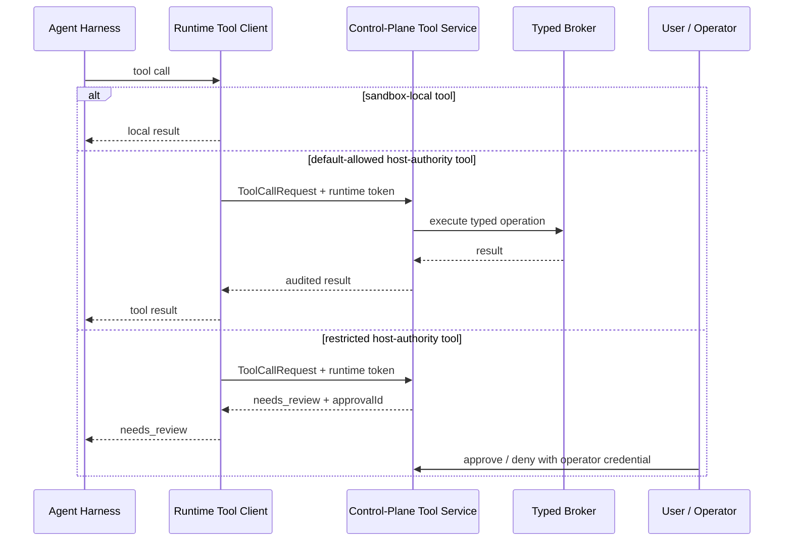
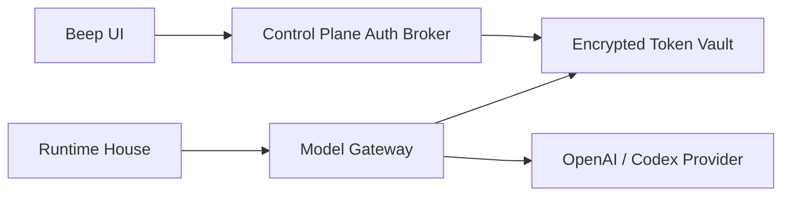

# Agent Runtime Boundaries

## Purpose

This is the canonical ownership model for Beep's agent runtime. Use these
boundaries when deciding where new runtime, tool, auth, LCM, approval, memory,
or proof-command behavior belongs.

The short rule: the agent should have broad freedom inside its workspace, but
all authority beyond that workspace must pass through a typed boundary.

## Three Zones

### 1. Control Plane / Authority Plane

The control plane is the host-side authority boundary. It owns user identity,
runtime lifecycle, model credential custody, capability grants, approval policy,
audit records, external tool dispatch, and broker execution for host-authority
operations.

It may start, stop, rebuild, snapshot, or hibernate runtimes. It may call private
runtime admin endpoints. It must not run the agent loop or contain Beep
personality logic.

### 2. Runtime House / Agent Data Plane

The runtime house is the sandboxed long-running agent service environment. It
owns `beep-agentd`, the Pi or Codex harness adapter, the runtime request queue,
local event stream, sandbox-local tool stubs, the LCM service, and runtime-local
state adapters.

The runtime house can execute the agent and maintain context, but it is not the
authority boundary for host actions. Anything needing host authority must call
the control-plane tool service with a scoped runtime capability token.

### 3. Agent Workspace / Untrusted Command Area

The agent workspace is the area where model-directed shell commands, file edits,
tests, builds, and generated artifacts run. The agent should have useful freedom
here, but workspace commands must not be treated as trusted infrastructure.

The workspace should not contain durable ChatGPT/OpenAI refresh tokens,
operator credentials, approval policy, broker credentials, production control
plane config, or raw host sockets. Runtime-owned service state such as LCM,
history, and queues should be accessed through runtime APIs or tools, not
treated as general scratch space.

## Ownership Map

| Concern | Owner | Notes |
|---|---|---|
| User identity and sessions | Control plane | Includes account binding and user/runtime namespace selection. |
| ChatGPT/OpenAI auth broker | Control plane | Starts and completes login flows. |
| Token vault and refresh tokens | Control plane / model gateway | Never store durable refresh credentials in the agent workspace. |
| Model gateway | Control plane / model gateway | Enforces model policy, usage accounting, account claims, and refresh. |
| Runtime lifecycle | Control plane / runtime manager | Start, stop, rebuild, hibernate, snapshot, and restore. |
| Agent loop | Runtime house | Pi/Codex harness, steering, follow-ups, aborts, and local turn state. |
| LCM engine | Runtime house | Pre-model context assembly and post-turn canonical transcript ingestion. |
| LCM DB and large files | Runtime-managed persistent volume | Durable per-runtime/user state; use `LcmService` as the write path. |
| LCM recall tools | Runtime tools | Main-agent exact-continuity tools: `lcm_grep`, `lcm_describe`, and `lcm_expand_query`; delegated expansion sessions also receive scoped `lcm_expand`. |
| LCM admin actions | Control plane calling private runtime endpoints | Compact, maintain, rotate, backup, doctor, export, and retention policy. |
| Semantic memory store | Runtime-managed persistent service | Durable facts, decisions, procedures, and entity relations with source refs back to LCM. |
| Preference records | Runtime-managed persistent service with control-plane policy | Learned user behavior and explicit preferences; cannot bypass approval or privacy policy. |
| Workspace files and builds | Agent workspace | Agent-editable work area. |
| Workspace history | Runtime service with control-plane-readable API | Checkpoints workspace changes; not the same as LCM. |
| Sandbox-local tools | Runtime house / workspace | Shell, file operations, tests, local grep, and LCM recall. |
| Host-authority tools | Control-plane tool service and broker | Docker, domain, location, secret, deployment, and other external authority. |
| Web tools | Control-plane tool service | `web_search` and `web_fetch`; provider keys and selection stay outside the runtime workspace. |
| Approvals and gatekeeper | Control plane | The runtime must never approve its own restricted action. |
| Audit log | Control plane | Approval, broker, lifecycle, deployment, and policy events. |
| Subagents | Split | Same-runtime subagents are runtime-owned; new isolated workers are control-plane/runtime-manager-owned. |

## Tool Call Path

Agent-visible tools can be local or control-plane-backed, but the harness should
see both as normal tools:

Rules:

- Register host-authority capabilities as normal harness tools only through a
  runtime tool stub.
- The runtime stub must call the control-plane tool service; it must not execute host
  authority directly.
- Runtime capability tokens may call `/internal/tools/call` and model-gateway
  credential endpoints only.
- Operator credentials may approve, deny, stop managed sites, and mutate
  lifecycle state. They must never be mounted into the runtime or passed to Pi.
- Restricted tools must fail closed when classification, approval, or broker
  execution is unavailable.

## LCM Placement

LCM belongs in the runtime house because it participates in the model turn:

1. Before provider calls, the harness asks the runtime LCM service to assemble
   context from summaries plus the protected fresh tail.
2. After completed turns, the runtime ingests canonical session messages through
   `LcmContextEngine`, not raw streaming events.
3. The agent accesses compacted history through runtime recall tools.
4. The control plane can operate LCM through private runtime endpoints for admin
   actions and future UI controls.

LCM is not the control plane. It should not own auth, approvals, tool policy,
Docker, domains, secrets, or user identity. LCM is also not the agent workspace;
workspace commands should not mutate the LCM DB directly.

## Memory Surface Placement

The agent should receive memory through always-on context hooks and direct
expansion tools, not through direct database access and not through a hard
branch that can bypass memory. First-party LCM is the initial memory surface:

- LCM context injection for passive continuity before every provider call that
  can carry conversational context.
- `lcm_grep` and `lcm_describe` for explicit exact recall.
- `lcm_expand_query` for bounded delegated DAG/source expansion from a query or
  summary IDs.
- `lcm_expand` only inside scoped delegated expansion sessions.

Semantic/search memory and preferences can be added as additional
always-considered context sources plus separate direct tools with evidence
references back to LCM. They are complementary search and recall layers, not
replacements for first-party LCM and not prerequisites for it.
See
[Beep Memory Surface](./beep-memory-surface.md).

## Auth Placement

Durable auth belongs outside the runtime house:

The runtime may receive a scoped, short-lived model gateway capability or a
local-dev compatibility token path. The production rule is stricter: no durable
refresh tokens in `/workspace`, `/state`, or any path writable by
model-directed commands.

## Proof Commands

Proof commands should prove the same seams the product will use:

- Agent-loop proofs run inside the runtime house and may write diagnostics under
  `/state/proofs`.
- LCM proofs must use the canonical `LcmService`/`LcmContextEngine` path, not a
  side writer that bypasses runtime ingestion.
- Tool-surface proofs should show the agent can see and call registered tools:
  one sandbox-local tool, one LCM recall tool, one default-allowed
  control-plane-backed tool, and one restricted tool that returns `needs_review`.
- Auth proofs may use local compatibility paths, but docs and tests must label
  them as dev-only and must not normalize durable runtime token custody.

## Boundary Tests

The baseline regression suite should assert:

- The agent can complete a turn through the long-running runtime.
- The runtime records canonical messages into LCM and can assemble future
  context from LCM.
- LCM recall tools are visible to the agent and return source-backed results.
- A default-allowed control-plane-backed tool succeeds through the tool service.
- A restricted control-plane-backed tool creates an approval and cannot be
  self-approved by the runtime token.
- The runtime cannot access operator credentials, raw Docker authority,
  production secrets, or unmounted host paths.
- Dev proof commands do not mutate LCM through legacy/raw-event paths.

## Current Recommended Next Step

With LCM now wired as the first-party Pi context surface, including model-backed
compaction and a live delegated `lcm_expand_query` proof, the next memory step
is hardening and expansion:

1. Harden LCM context injection with automated summary-backed tests.
2. Promote the live delegated `lcm_expand_query` proof into an automated
   regression.
3. Finish ignore/stateless write policy for delegated and low-value sessions.
4. Add lifecycle regression tests for reset, new session, fork, and shutdown.
5. Keep LCM admin endpoints private to the control plane.

The boundary proof remains a hardening milestone, but it should validate this
same tool and memory shape rather than a temporary interface.
