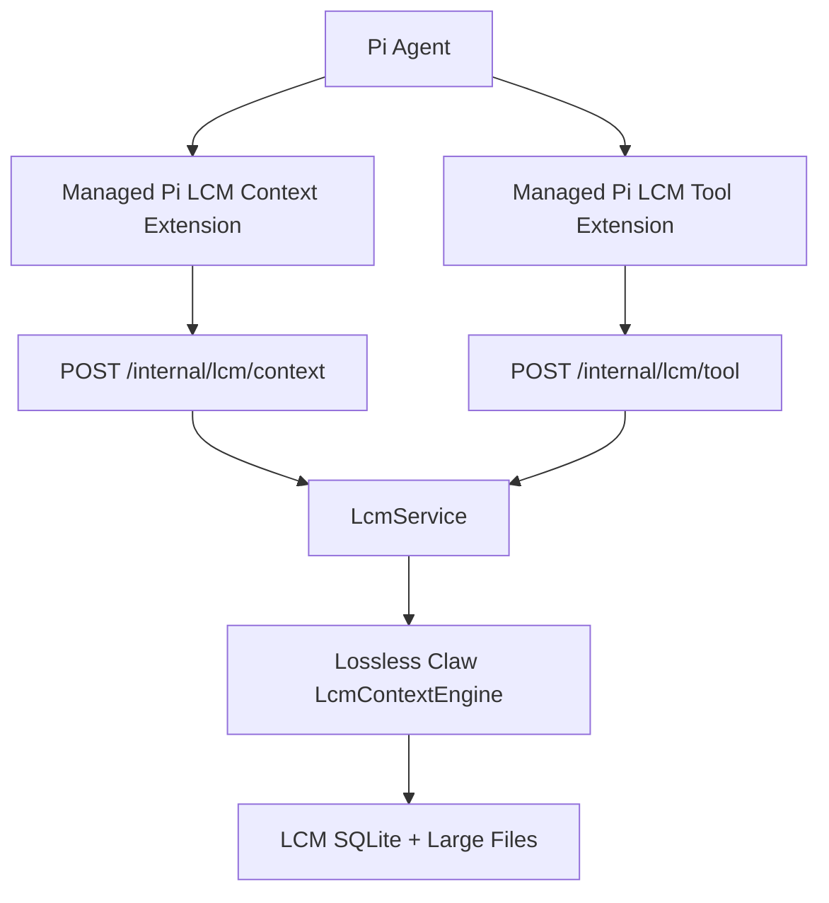

# Beep Memory Surface

## Purpose

This document defines how memory reaches the agent. The design goal is
always-on first-party context assembly, not a meta memory layer.

The short rule: every model call gets bounded, source-backed context assembled
by first-party runtime hooks. Model-callable tools exist for expansion, not for
deciding whether memory applies. LCM owns exact continuity and compaction.
Semantic/search memory is an additive recall layer that should sit beside LCM
as another always-considered context source and as direct tools. It is not a
replacement for LCM and it is not required before LCM can work.

## Current State

Implemented:

- Lossless Claw is vendored as the runtime LCM engine.
- Pi context injection calls the runtime LCM service before provider requests.
- Pi loads managed runtime extensions explicitly with `--extension`.
- Pi auto-discovery is disabled with `--no-extensions`.
- `lcm_grep`, `lcm_describe`, and `lcm_expand_query` are registered as
  main-agent Pi-native runtime tools.
- `lcm_expand_query` creates a bounded delegated Pi expansion session, and that
  delegated session receives `lcm_grep`, `lcm_describe`, and scoped
  grant-backed `lcm_expand`.
- `POST /internal/lcm/tool` executes those tools through the in-process
  `LcmService`.
- The managed LCM recall extension adds a Pi `before_agent_start` system-prompt
  policy that tells the agent when to use exact recall tools.
- Completed turns call `LcmContextEngine.afterTurn(...)` through `LcmService`,
  so LCM owns post-turn ingestion and compaction policy.
- LCM compaction uses Beep's model credential adapter for model-backed
  summaries, with Beep's runtime default preserving an 8-message fresh tail
  unless `LCM_FRESH_TAIL_COUNT` or `BEEP_LCM_FRESH_TAIL_COUNT` overrides it.
- Pi session lifecycle hooks forward new/resume/fork/shutdown events to LCM
  lifecycle handlers.
- Live proof `lcm-real-proof-final_20260525t031040171z_a12865d1` forced real
  model-backed compaction, then called `lcm_expand_query`; the delegated Pi
  worker `lcm_expansion_20260525t031044817z_eeebe3a5` called scoped
  `lcm_expand` and returned citation `sum_fd52c0d6d902ab75`.

Not implemented yet:

- Automated summary-backed live-context and delegated recall regression tests.
- Semantic/search memory for durable cross-session search and recall.

## Placement

Memory belongs in the runtime house as agent data-plane infrastructure. The
control plane owns account identity, grants, auth, approvals, retention policy,
and admin actions. The agent workspace must not query memory databases directly.
The runtime should not decide memory relevance through hard branch rules.
Relevance is a ranking, budgeting, and citation problem inside context assembly.

The Pi extensions are only harness adapters. They register tools and hooks, and
they add tool-use policy to the agent prompt. They do not own memory storage,
create a second LCM engine, hold external service keys, or make storage policy
decisions.

## First-Party LCM Behavior

First-party LCM is not a semantic search system. It is an exact continuity and
always-on context assembly system.

The first-party shape is:

1. Bootstrap or reconcile the canonical session transcript.
2. Ingest canonical agent messages after completed turns.
3. Preserve structured message parts, tool calls, tool results, usage, response
   IDs, timestamps, and large payload references.
4. Compact old transcript ranges into summaries when policy says the active
   context is too large.
5. Assemble future provider context from compacted summaries plus a protected
   fresh tail.
6. Register model-callable recall tools so the agent can search and expand old
   history on demand.
7. Handle lifecycle events such as reset, session end, maintenance, backup, and
   rotation through runtime/control admin paths.

This does not require semantic/search memory. LCM can proceed now. The important
distinction is that LCM is the continuity and compaction system. Its recall
tools inspect LCM transcripts and compacted summaries; they are not a semantic
memory database. Semantic/search memory should be added beside LCM for concept,
entity, preference, and cross-session retrieval.

## Agent-Facing Tools

### Current Tools

`lcm_grep`

- Searches canonical transcript messages and compacted summaries.
- Supports regex and full-text search.
- Returns message references, summary IDs, timestamps, and bounded snippets.
- Use for exact recall, quoted details, old requests, and debugging continuity.

`lcm_describe`

- Expands a specific LCM summary or stored file reference.
- Use after `lcm_grep` returns an ID that needs more detail.

`lcm_expand_query`

- Searches for candidate summaries with the same full-text path as `lcm_grep`,
  or expands explicit summary IDs.
- Creates a bounded delegated Pi expansion session for deep recall.
- The delegated session receives only the LCM recall surface it needs:
  `lcm_grep`, `lcm_describe`, and scoped `lcm_expand`.
- `lcm_expand` is grant-backed and restricted to the candidate conversation IDs
  and source token cap selected by `lcm_expand_query`.
- Returns a compact answer with cited LCM summary IDs to the main agent.

`lcm_expand`

- Expands LCM summary DAG nodes and leaf source messages under a token cap.
- Is not a main-agent tool. It is only registered in delegated LCM expansion
  sessions and requires a runtime expansion grant.

Do not replace these with a generic memory meta-tool. The passive
context hook gives every call a useful context floor. Explicit tools let the
agent expand from that floor when the question needs old detail, alternate
wording, or broader historical search.

## Passive Context Injection

The runtime should keep the existing passive LCM context hook and harden it.
This hook must run before every provider request that can carry conversational
context:

1. Before a provider request, the Pi context extension calls
   `POST /internal/lcm/context`.
2. `LcmService` calls `LcmContextEngine.assemble(...)` with the live Pi message
   array and token budget.
3. The returned context replaces or augments the active provider context.
4. Pi native auto-compaction stays disabled while LCM owns context assembly.

The injected context must be source-backed and compact. It should not dump full
history into every turn. If the answer needs exact old detail, the agent should
call `lcm_grep`, `lcm_describe`, or `lcm_expand_query`.

Context assembly should be tolerant of non-hardline queries. A user may ask a
vague, partial, or exploratory question that only becomes clearly historical
after the model starts reasoning. The right behavior is not to steer the call
away from memory. The right behavior is to include a small, generally useful
continuity layer by default, then let the model call recall tools if it needs
more.

## Semantic/Search Memory

Semantic/search memory is separate from first-party LCM and should be additive,
not comparative or substitutive.

Use semantic/search memory for:

- Stable facts and decisions.
- User or project preferences.
- Procedures learned over time.
- Entity-centric recall across sessions.
- Paraphrased concept recall when exact transcript search is too brittle.

Do not block LCM on semantic/search memory. Treat semantic/search memory as
additive from the start, not as a fallback after LCM failure. When present, it
should participate in the same always-on context assembly budget as LCM, so both
exact continuity and semantic recall are considered before the model call. Also
expose direct tools such as
`semantic_search`, `semantic_remember`, or `preference_list`, and keep evidence
references back to LCM message IDs or summary IDs.

## Research Patterns

The major memory systems do not require a meta memory layer in front of the
agent:

- Mem0 exposes direct `add`, `search`, `update`, and `delete` memory operations.
  Current OSS retrieval uses semantic candidates with BM25 and entity boosting;
  graph-store support was removed from OSS in favor of entity linking.
- LangGraph separates short-term checkpoints from long-term stores. Agents or
  graph nodes call store `put`/`search` directly when they need memory.
- Zep/Graphiti exposes direct graph add/search behavior over episodes, entities,
  and temporal facts. Retrieval combines semantic, keyword, and graph traversal,
  with provenance back to raw episodes.

The useful pattern for Beep is always-on context injection plus direct tools:
small automatic context before every call, exact recall tools when the agent
needs detail, and source references for anything durable.

## Web Search Relationship

Web search is not memory. It is an external freshness tool.

Web search results may be written into LCM as normal tool calls and tool
results. They should become semantic memory only after extraction and salience
checks. A one-off search result should not become a durable user fact unless it
supports a decision, preference, project state, or cited artifact that Beep needs
later.

Recommended direct tool shape:

- `web_search`: returns ranked URLs, titles, snippets, source metadata, and
  optional extracted text chunks.
- `web_fetch`: fetches and extracts a specific URL.
- `web_research`: optional later tool for slower multi-source synthesis.

All web tools should be direct model-callable tools. The implementation can live
behind a runtime or control-plane service depending on where the API key and
network authority live, but the agent should see a normal tool call, not an
intermediate abstraction.

Current architecture: `web_search` and `web_fetch` are control-plane-backed Pi
tools with vendored provider adapters. See
[Web Tool Surface](./web-tool-surface.md).

## Implementation Order

1. Harden always-on passive context injection with summary-backed tests.
2. Keep `lcm_grep`, `lcm_describe`, and `lcm_expand_query` as main-agent exact
   recall tools, with `lcm_expand` restricted to delegated expansion sessions.
3. Promote the live delegated `lcm_expand_query` proof into an automated
   summary-backed regression.
4. Keep web tools direct and control-plane-backed; add provider benchmarks
   before changing the default provider.
5. Add semantic/search memory as the complementary search and recall layer
   beside LCM, with context assembly considering both sources within budget.

## Research Basis

- Mem0's current OSS memory algorithm uses semantic vector search with optional
  BM25 and entity boosting. Its graph-store support was removed from the OSS SDK
  in favor of entity linking inside the vector store.
- LangGraph treats memory as short-term checkpoints plus long-term stores. Its
  store layer can support semantic search when configured with embeddings, but
  it is not a dependency for Beep's Pi runtime.
- Zep's Graphiti builds temporal context graphs from episodes, entities, and
  facts. Retrieval is hybrid: semantic, keyword, and graph traversal, with
  temporal validity and provenance.

For Beep, the practical next step is summary-backed LCM hardening and recall
benchmarks, followed by semantic/search memory as a complementary recall
capability. Semantic/search memory should be designed as a direct capability
with evidence references, not as a replacement for LCM.
