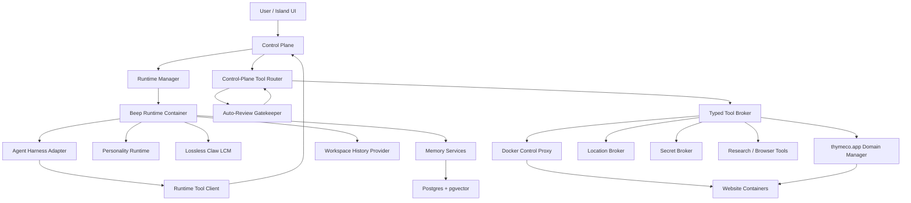
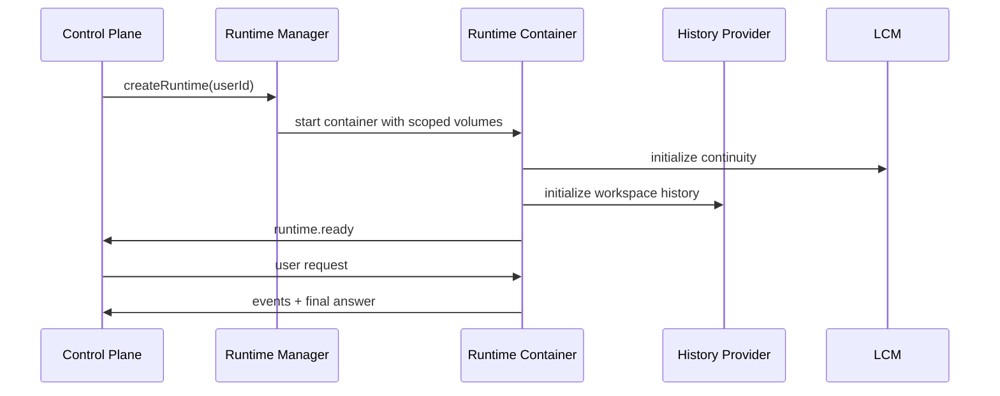
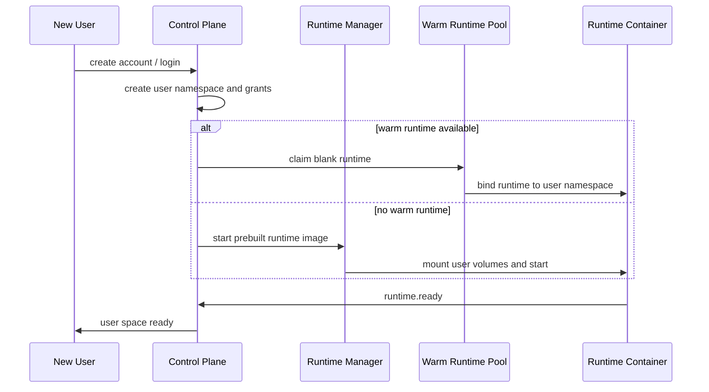
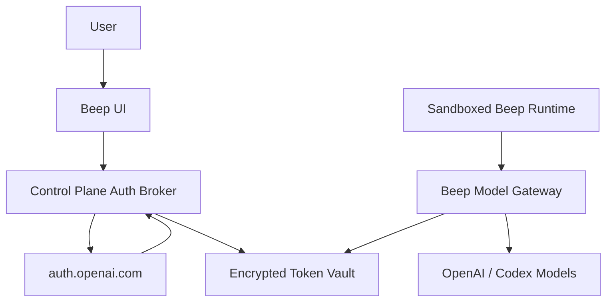
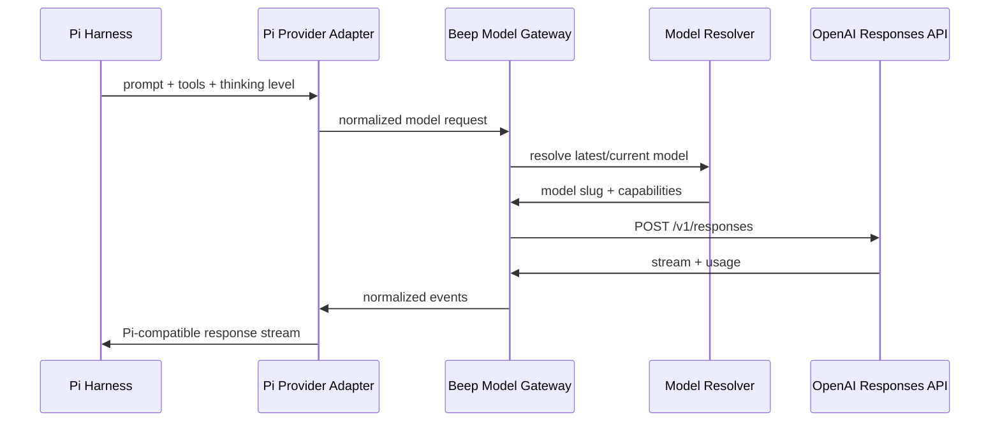
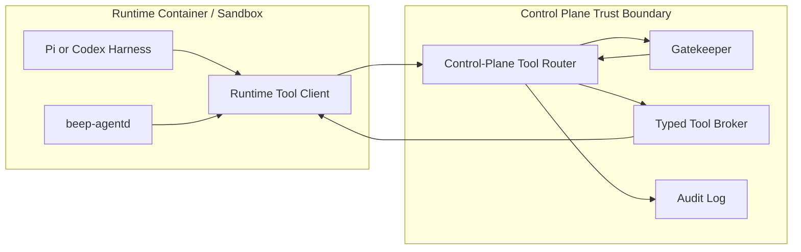
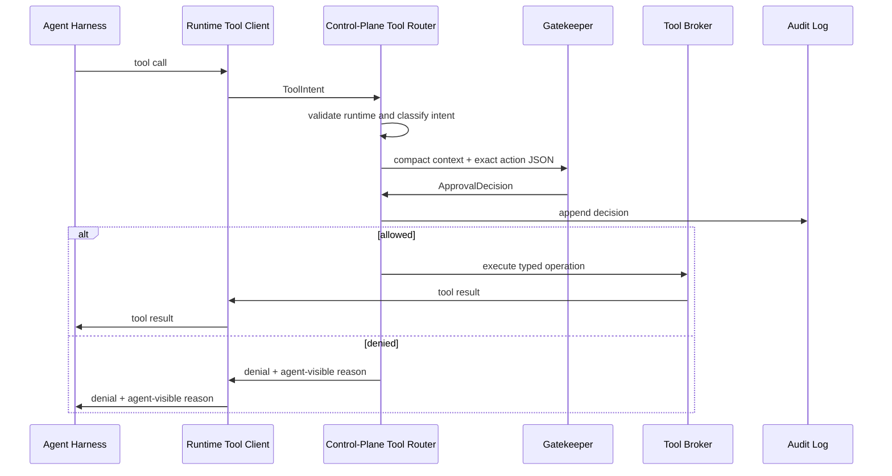
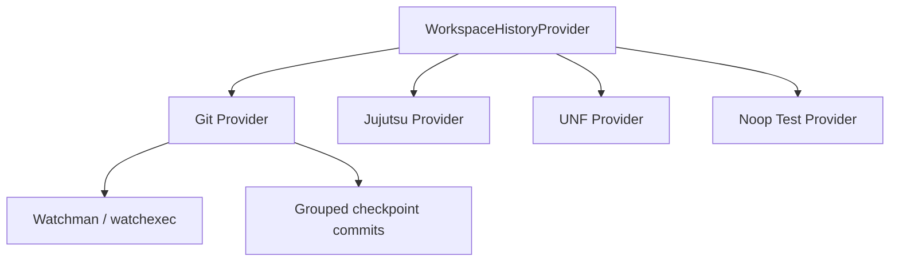
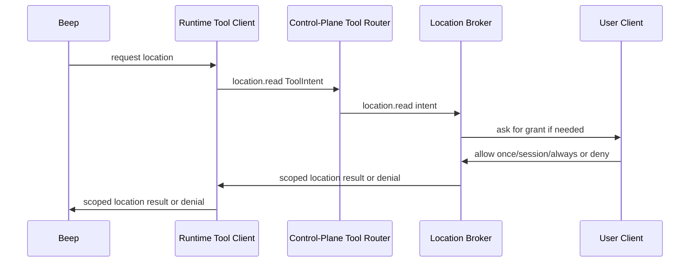

# Beep Modular Implementation Plan

## Purpose

Beep is an autonomous agent runtime that can receive a user request, work inside an isolated runtime, use tools, remember context, create or modify websites, request sensitive capabilities through an approval gate, and report results back through a control plane and an eventual 2.5D island interface.

The system should be built as a set of replaceable modules. Pi, Codex-inspired approvals, Lossless Claw, Docker orchestration, memory, workspace history, and the island UI should not be tangled together. Each piece gets a clear interface so we can swap implementations without rebuilding the whole platform.

## Architectural Principles

1. Keep the agent runtime powerful inside its own house, but narrow at every boundary.
2. Treat the gatekeeper as infrastructure, not a conversational participant.
3. Put personality in the runtime, not only in the UI.
4. Prefer typed control APIs over raw host access.
5. Make recovery a layered system, not a single tool.
6. Make every user-facing capability multi-user safe from the beginning.
7. Build staging/self-improvement as a separate lane from production.

## Top-Level System



## Module 1: Control Plane

The control plane owns user identity, runtime lifecycle, capability grants, audit history, external tool routing, approval policy, and routing between the UI and runtime containers.

Responsibilities:

- Authenticate users.
- Create, destroy, pause, resume, and rebuild runtimes.
- Store user-level settings and capability grants.
- Route user requests into the correct runtime.
- Receive runtime events and stream them to clients.
- Receive external tool intents from runtimes and route them through policy, approval, and broker execution.
- Store audit records for approvals, deployments, memory changes, and recovery actions.
- Own production policy and prevent runtime self-modification from changing it.

Non-responsibilities:

- It should not run the agent loop.
- It should not contain Beep personality logic.
- It should not expose raw Docker or secrets directly to the runtime.
- It should not execute high-risk host actions inline when a typed broker service owns that capability.

Core interfaces:

```ts
type RuntimeRequest = {
  requestId: string;
  userId: string;
  runtimeId: string;
  message: string;
  attachments: AttachmentRef[];
  requestedCapabilities: string[];
  clientContext: ClientContext;
};

type RuntimeEvent =
  | AgentProgressEvent
  | AgentFinalEvent
  | ToolStatusEvent
  | ApprovalStatusEvent
  | BeepStateEvent
  | MemoryEvent
  | RecoveryEvent;
```

## Module 2: Runtime Manager

The runtime manager owns the physical lifecycle of runtime containers and persistent volumes. It is controlled by the control plane, not by the agent directly.

Responsibilities:

- Launch one runtime per user or session.
- Mount persistent volumes for workspace, LCM logs, memory cache, and history.
- Rebuild a runtime container from a candidate image.
- Snapshot or restore runtime volumes.
- Enforce per-user labels and resource limits.
- Register runtime health with the control plane.

Required runtime volumes:

```text
/workspace        agent-editable work area
/lcm              Lossless Claw continuity logs
/history          workspace history backend storage
/state            runtime state and event cursor
/tmp              disposable working directory
```

Runtime lifecycle:



## Module 2A: Per-User Provisioning Model

The system should support creating a new user space in seconds, but only if heavyweight work is moved out of the signup path. User creation should allocate identity, metadata, namespaces, and lightweight storage immediately. Runtime images should already be built and pulled. The first container should either come from a warm pool or start from a prebuilt image.

Provisioning modes:

- `cold`: create account, create volumes, start runtime container from prebuilt image, initialize runtime.
- `warm`: assign an already-running blank runtime, attach user namespace, initialize user state.
- `hibernated`: restart a stopped runtime with existing volumes.
- `pooled`: keep a small number of empty runtimes ready for immediate assignment.

Recommended v1:

- Use shared Postgres, shared vector store, shared tool broker, and shared control plane.
- Create one isolated runtime container per active user/session.
- Keep user data isolated by namespace, labels, grants, and mounted volumes.
- Keep the runtime image prebuilt and pre-pulled on the host.
- Use hibernation after inactivity instead of keeping every user runtime hot forever.
- Add a small warm pool only when signup/login latency becomes product-critical.

Expected latency targets on a healthy host:

```text
Account/control-plane record creation       < 1 second
Namespace + grants + metadata setup         < 1 second
Volume creation or mount                    < 1 second
Warm pooled runtime assignment              1-3 seconds
Prebuilt container cold start               3-10 seconds
Runtime health check + event stream ready   2-8 seconds
Full image build or dependency install      30 seconds to minutes; not signup-path safe
```

Overhead model:

- Idle runtime container: moderate memory overhead, low CPU when no idle tasks run.
- Active research/browser task: high burst memory and CPU, especially if browser automation is enabled.
- Always-on personality loop: should be scheduled and budgeted, not an infinite active process per user.
- Shared services are cheaper than per-user databases, brokers, proxies, and vector stores.
- Per-user isolation should be done with runtime containers, storage namespaces, labels, and grants before considering full per-user service stacks.

Provisioning flow:



The main implementation constraint is that no signup path should build images, install dependencies, provision a dedicated database, or clone large repos. Those operations belong in image preparation, background provisioning, or staging update lanes.

## Module 2B: ChatGPT And Codex Authentication

Users should be able to authenticate with ChatGPT so Beep can use their eligible Codex/OpenAI model access when the product supports that mode. This should be modeled after Codex's open-source authentication flow, but token custody should belong to Beep's control plane or model gateway, not to the editable agent workspace.

Codex supports three relevant authentication paths:

- Browser-based ChatGPT OAuth using a localhost callback.
- Device-code ChatGPT OAuth for headless or remote environments.
- API key or access-token login for automation and enterprise workflows.

Recommended Beep architecture:



Responsibilities:

- The auth broker starts and completes ChatGPT login.
- The token vault stores refresh/access credentials encrypted per user.
- The runtime does not receive durable refresh tokens.
- The Pi harness calls a local model provider or model gateway, not raw ChatGPT auth endpoints.
- The model gateway enforces user/session/model policy, records usage, and refreshes tokens as needed.

Codex browser OAuth shape, from the open-source implementation:

```text
issuer:       https://auth.openai.com
authorize:    GET /oauth/authorize
token:        POST /oauth/token
callback:     http://localhost:1455/auth/callback, with 1457 fallback
scopes:       openid profile email offline_access api.connectors.read api.connectors.invoke
PKCE:         S256 code challenge
```

Codex device-code shape:

```text
request code: POST https://auth.openai.com/api/accounts/deviceauth/usercode
verify URL:   https://auth.openai.com/codex/device
poll token:   POST https://auth.openai.com/api/accounts/deviceauth/token
timeout:      15 minutes in the Codex implementation
complete:     exchange returned authorization_code through /oauth/token
```

QR-code login:

- Yes, Beep can support QR-code login using the Codex device-code flow.
- The QR should open the verification URL.
- The UI should display the one-time user code next to the QR.
- Do not assume the code can be embedded into the URL unless the endpoint is explicitly verified to support that.
- If device-code login is disabled for a user's ChatGPT account or workspace, fall back to browser OAuth or API/access-token setup.

Credential handling:

- Do not store ChatGPT tokens in the runtime workspace.
- Do not commit, log, or expose `auth.json`.
- Prefer encrypted server-side token storage.
- If a local proof uses Codex's `auth.json`, mount it read-only and treat it as a temporary compatibility path, not production architecture.
- Support workspace restrictions by checking the ChatGPT workspace/account claims, matching Codex's forced workspace pattern.

Open question for implementation:

- Whether Beep can use Codex's public client configuration directly for a hosted product, or needs a registered first-party/approved OAuth client. The implementation should verify this against OpenAI's current platform rules before shipping production login.

## Module 3: Agent Harness Adapter

The first implementation should use Pi as the vendored harness. Codex should be treated as the reference for approval semantics, sandboxing concepts, and protocol ideas.

Responsibilities:

- Translate `RuntimeRequest` into a harness turn.
- Run the autonomous agent loop.
- Register only sandbox-local tools and capability stubs that forward external intents to the control plane.
- Stream structured events back to the runtime event bus.
- Persist enough state for LCM and recovery.

Default implementation:

- `PiHarnessAdapter`

Optional later implementation:

- `CodexHarnessAdapter`, if the project later decides Codex is a better primary runtime.

Important boundary:

- The harness should not call host tools directly.
- The harness should only call sandbox-local runtime tools.
- Runtime tools that need external capabilities should submit `ToolIntent` requests to the control-plane router.
- The runtime must not own approval policy, gatekeeper prompts, durable grants, or broker credentials.
- Harness-specific concepts should not leak into the control plane API.

## Module 3A: Pi Codex/OpenAI Provider Adapter

Pi should not hard-code a specific OpenAI model. It should receive a model policy from the runtime config and call a Beep model gateway that resolves the current default model, reasoning effort, verbosity, and usage tracking.

Responsibilities:

- Expose an OpenAI/Codex-compatible provider to Pi.
- Resolve `model = "latest"` or `model = "current"` through a model resolver, not a hard-coded slug.
- Map Pi's thinking level to OpenAI Responses API `reasoning.effort`.
- Map Pi's output-length setting to OpenAI `text.verbosity` when supported.
- Return normalized usage stats after each turn.
- Preserve response IDs and output items for LCM, compaction, replay, and usage accounting.
- Keep ChatGPT refresh tokens outside the sandbox.

Provider flow:



OpenAI API surface to support first:

```text
GET  /v1/models
GET  /v1/models/{model}
POST /v1/responses
GET  /v1/responses/{response_id}
POST /v1/responses/{response_id}/cancel
GET  /v1/responses/{response_id}/input_items
POST /v1/responses/compact
POST /v1/responses/input_tokens
```

Codex source patterns to mirror:

- Use Responses API for agentic/tool-heavy turns.
- Pass `reasoning.effort` instead of encoding thinking level only in prompts.
- Use `text.verbosity` where supported.
- Use `prompt_cache_key` for repeatable session caching.
- Track `response_id` for resume/replay.
- Record token usage, including cached input and reasoning output when present.
- Keep model/provider/auth config at the user/runtime config layer, not project-local untrusted config.

Initial model policy:

```ts
type ModelPolicy = {
  requestedModel: "latest" | "current" | string;
  reasoningEffort: "none" | "minimal" | "low" | "medium" | "high" | "xhigh";
  verbosity?: "low" | "medium" | "high";
  serviceTier?: "flex" | "fast" | string;
};
```

The model resolver should periodically fetch or vendor current OpenAI model guidance during staging updates. As of May 2026, OpenAI's latest-model guide resolves the latest model to `gpt-5.5`, but Beep should treat that as data, not architecture.

## Module 4: Control-Plane Tool Router

The tool router lives in the control-plane trust boundary. The runtime has only a thin `ToolClient` that serializes agent intent and sends it to the control plane. This keeps approval policy, durable grants, broker credentials, and cross-user enforcement outside the editable runtime container.

Responsibilities:

- Receive every external runtime tool request as a `ToolIntent`.
- Authenticate the runtime and bind the intent to the owning user, request, and runtime.
- Classify the action by risk and required capability.
- Call the gatekeeper when approval is needed.
- Forward allowed requests to the typed tool broker.
- Return tool results or denials to the harness through the runtime `ToolClient`.
- Emit audit and status events back to the control plane event stream.

Core interface:

```ts
type ToolIntent = {
  intentId: string;
  runtimeId: string;
  userId: string;
  tool: string;
  action: string;
  args: unknown;
  target?: ResourceRef;
  riskHints: RiskHint[];
  requiredCapabilities: CapabilityRef[];
};
```

The router is mandatory even for low-risk tools. This gives us one place for logging, metrics, memory hooks, and future policy.

Sandbox boundary:



`beep-agentd` may host the runtime-local request queue, event stream, Pi RPC process, LCM adapter, and sandbox tool stubs. It must not become the durable external tool router or the gatekeeper.

## Module 5: Auto-Review Gatekeeper

The gatekeeper is a separate approval model call modeled after Codex auto-review. It runs from the control-plane trust boundary, not inside the agent runtime. It is not a chat participant, but it is allowed to escalate to the user. It replaces manual allow/deny requests when the user permits automated review, and falls back to user approval when the action is outside policy, ambiguous, too risky, or requires a durable capability grant.

Responsibilities:

- Review exact proposed actions.
- Use compact context and current grants.
- Return strict JSON.
- Fail closed on timeout, invalid JSON, or model error.
- Maintain denial counters and circuit breakers.
- Return an agent-visible outcome so the agent can continue, find another path, or report that user approval is required.
- Keep hidden chain-of-thought and private reviewer policy out of the agent loop.
- Escalate to the user for explicit approval when policy requires human authorization.

Approval flow:



Core interface:

```ts
type ApprovalRequest = {
  approvalId: string;
  userId: string;
  runtimeId: string;
  compactContext: string;
  action: ToolIntent;
  currentGrants: CapabilityGrant[];
  policyVersion: string;
};

type ApprovalDecision = {
  approvalId: string;
  outcome:
    | "allow"
    | "allow_for_session"
    | "deny"
    | "timeout"
    | "circuit_breaker"
    | "escalate_to_user";
  riskLevel: "low" | "medium" | "high" | "critical";
  userAuthorization: "none" | "low" | "medium" | "high";
  auditRationale: string;
  agentMessage: string;
  userPrompt?: string;
};
```

Approval domains:

- Docker operations.
- Website creation, promotion, destruction, and domain changes.
- Location access.
- Secret access.
- Spending or purchasing.
- External communications.
- Memory promotion.
- Runtime self-modification.
- Cross-user or production operations.

## Module 6: Typed Tool Broker

The tool broker runs outside the runtime container and exposes typed operations. It is the only layer allowed to touch high-risk host capabilities.

Responsibilities:

- Execute approved tool operations.
- Enforce user and runtime ownership labels.
- Hide raw credentials.
- Validate request schemas before execution.
- Return sanitized results.
- Emit audit events.

Initial broker services:

- `DockerControlService`
- `WebsiteFactoryService`
- `DomainRoutingService`
- `LocationService`
- `SecretService`
- `ResearchService`
- `MemoryService`
- `WorkspaceHistoryService`

Important rule:

- The runtime must never receive the raw Docker socket.

## Module 7: Docker Control Proxy

The Docker control proxy should expose only the operations Beep needs, not Docker itself.

Allowed operation families:

- Create staging website container.
- Rebuild staging website container.
- Stop staging website container.
- Promote staging website container to production.
- Roll back production website container.
- Destroy owned staging container.
- Destroy owned production container only with explicit approval.
- Build runtime candidate image in staging.

Enforcement:

- Every container gets `beep.user_id`, `beep.runtime_id`, `beep.site_id`, and `beep.environment` labels.
- Cross-user operations are rejected.
- Unlabeled containers are invisible to the agent path.
- Production destructive operations require gatekeeper approval and usually user confirmation.

## Module 8: Website Factory And `*.thymeco.app`

The website factory lets Beep create, modify, test, and deploy websites under controlled subdomains.

Default approach:

- Use Traefik if Docker-label routing is central.
- Use Caddy if simpler route config and TLS management are more important.
- Use wildcard DNS and DNS-01 TLS for `*.thymeco.app`.

Website lifecycle:

```mermaid
flowchart LR
  Request["User asks for site"] --> Workspace["Create site workspace"]
  Workspace --> Checkpoint["History checkpoint"]
  Checkpoint --> Build["Build staging image/container"]
  Build --> Route["Attach staging subdomain"]
  Route --> Smoke["Run smoke tests"]
  Smoke --> Review["Agent reports preview"]
  Review --> Promote["Approval-gated promotion"]
  Promote --> Prod["Production subdomain"]
```



Core interface:

```ts
type WebsiteSpec = {
  siteId: string;
  ownerUserId: string;
  subdomain: string;
  workspacePath: string;
  framework?: string;
  environment: "staging" | "production";
  containerImage?: string;
  secrets: SecretRef[];
};
```

## Module 9: Workspace History Provider

The workspace history provider is Beep's Time Machine abstraction. It should be implemented with known tools first, not tied to UNF.

Default implementation:

- File watcher: Watchman or watchexec.
- Backend: Git.
- Optional experiment: Jujutsu.
- Optional later provider: UNF.

Responsibilities:

- Create meaningful checkpoints.
- Show diffs.
- Restore one file, a directory, or a checkpoint range.
- Generate recaps for the next agent or control plane.
- Ignore noisy/generated paths.
- Protect sensitive paths from accidental restore or exposure.

Core interface:

```ts
interface WorkspaceHistoryProvider {
  checkpoint(input: CheckpointInput): Promise<CheckpointRef>;
  diff(input: DiffInput): Promise<WorkspaceDiff>;
  restore(input: RestoreInput): Promise<RestoreResult>;
  recap(input: RecapInput): Promise<WorkspaceRecap>;
  listCheckpoints(input: CheckpointQuery): Promise<CheckpointRef[]>;
}
```

Provider strategy:



Recommendation:

- Build `GitWorkspaceHistoryProvider` first.
- Add `UnfWorkspaceHistoryProvider` only after the rest of the system can compare providers against the same tests.

## Module 10: Lossless Claw LCM

Lossless Claw should be vendored as the continuity layer, separate from semantic memory and workspace history.

Responsibilities:

- Preserve conversation continuity.
- Recover context after compaction or runtime restart.
- Store structured session history.
- Provide exact context anchors for future turns.

Boundary:

- LCM is not the file Time Machine.
- LCM is not the semantic memory database.
- LCM is not the preference learner.

## Module 11: Memory And Preference Learning

Memory should be split into exact continuity, semantic recall, and structured preferences.

Layers:

- Lossless Claw for exact continuity.
- Postgres plus pgvector for semantic recall.
- Structured preference records for learned user behavior.

Lossless Claw must be integrated as a first-party runtime context engine, not as
a passive event sink. The implementation plan for that work lives in
[LCM First-Party Integration Plan](./lcm-first-party-integration-plan.md).

Preference model:

```ts
type PreferenceCandidate = {
  preferenceId: string;
  userId: string;
  statement: string;
  evidenceCount: number;
  confidence: number;
  sourceEvents: string[];
  status: "candidate" | "active" | "rejected" | "expired";
  lastSeenAt: string;
};
```

Rules:

- Repeated behavior can create a candidate.
- Repeated consistent behavior can promote it.
- Explicit user correction overrides inferred preferences.
- Preferences cannot override approvals, privacy, spending, or destructive-action policy.

## Module 12: Location And Consent

Location is a capability grant. The runtime never gets ambient location access.

Supported approaches:

- Precise client-mediated location from browser or mobile OS permission.
- Coarse account/profile/IP-derived location.
- Manual user-set location.

Flow:



## Module 13: Personality Runtime

Personality belongs inside the runtime because it should influence how Beep works, remembers, and expresses itself.

Responsibilities:

- Maintain Beep state.
- Decide idle tangents within budgets.
- Shape communication style.
- Weight memory salience.
- Emit state events to the island UI.

Non-responsibilities:

- It must not approve actions.
- It must not weaken policies.
- It must not access secrets directly.
- It must not mutate gatekeeper prompts or control-plane settings.

Core state:

```ts
type BeepState = {
  mood: string;
  energy: number;
  focus: string;
  currentPlace: "library" | "workshop" | "time_machine" | "dock" | "observatory" | "town_hall";
  currentTask?: string;
  idleTangent?: string;
  discoveriesToShare: DiscoveryRef[];
  pendingApproval?: string;
};
```

## Module 14: Island Projection

The island is a projection of runtime truth. It should not become a second source of agent state or policy.

Buildings:

- Library: memory and research.
- Time Machine: workspace history, restore, recaps.
- Workshop: websites and code projects.
- Observatory: idle research and tangents.
- Town Hall: approvals, settings, capability grants.
- Dock: future Beep-to-Beep or external-agent connections.

Island event source:

- Runtime emits `BeepStateEvent`.
- Control plane streams events to clients.
- UI renders state and sends user input back through control plane.

## Implementation Slices

### Slice 0: Repository And Contract Skeleton

Deliverables:

- Monorepo structure.
- Shared TypeScript contracts for runtime, events, tools, approvals, memory, history, and websites.
- Minimal package boundaries.
- Development compose file for local services.

Suggested package layout:

```text
apps/
  control-plane/
  runtime/
  tool-broker/
  island/
packages/
  contracts/
  harness-pi/
  runtime-tool-client/
  tool-router/
  gatekeeper/
  workspace-history/
  lcm/
  memory/
  website-factory/
  personality/
  testing/
```

Acceptance:

- Packages compile.
- Contract tests verify schemas.
- No module imports across forbidden boundaries.

### Slice 1: Sandboxed Harness Loop And LCM Proof

Deliverables:

- Runtime container with no raw host Docker socket and no production secrets.
- Mounted `/workspace`, `/lcm`, `/history`, `/state`, and `/tmp` paths.
- `HarnessAdapter` interface that can support Pi or Codex.
- Pi vendored as the first concrete harness adapter.
- Codex adapter left as a later implementation, while Codex approval/sandbox behavior remains the reference model.
- Pi Codex/OpenAI provider adapter for model calls.
- Model resolver that supports `latest`/`current` without hard-coding a model slug.
- Mapping from Pi thinking level to OpenAI `reasoning.effort`.
- Normalized usage stats from model responses.
- Lossless Claw vendored behind an `LcmAdapter`.
- Minimal local request API or CLI entrypoint.
- Basic structured event stream.
- Restart/resume smoke test.
- One local request can run through the sandboxed agent and return a final answer.

Acceptance:

- Runtime can be built and started from a prebuilt image.
- Runtime can run one Pi harness turn inside the container.
- Runtime writes LCM continuity for the turn.
- Runtime survives restart with LCM continuity intact.
- Runtime can resume or summarize prior context from LCM after restart.
- Runtime emits progress and final events.
- Harness only sees registered runtime tools.
- Runtime cannot access host Docker or unmounted host paths.
- The proof does not require website creation, real Docker orchestration, multi-user auth, or the island UI.

### Slice 2: Workspace History Provider

Deliverables:

- `WorkspaceHistoryProvider` interface.
- Git-backed provider.
- Watchman or watchexec checkpoint service.
- Ignore/protect path configuration.
- Control-plane-readable diff, restore, recap.

Acceptance:

- Edits produce grouped checkpoints.
- Diff and recap are deterministic.
- Single-file restore works.
- Generated directories are excluded.

### Slice 3: Tool Router And Broker Boundary

Deliverables:

- Runtime-local `ToolClient` stub.
- Control-plane tool router.
- Typed broker outside runtime.
- ToolIntent schema.
- Broker service skeletons.
- Audit logging.

Acceptance:

- Agent cannot call host tools directly.
- `beep-agentd` cannot bypass the control-plane router for external capabilities.
- All tool calls produce ToolIntent records.
- Broker rejects malformed requests.

### Slice 4: Gatekeeper Auto-Review And Escalation

Deliverables:

- Control-plane auto-review approval reviewer.
- Strict JSON response validation.
- Compact context builder.
- Codex-style fail-closed behavior.
- Denial counters and circuit breaker.
- Manual approval fallback.
- User escalation path for ambiguous or high-risk actions.

Acceptance:

- Low-risk actions pass.
- Secret exfiltration is denied.
- Cross-user access is denied.
- Invalid reviewer output fails closed.
- Main agent cannot see hidden gatekeeper rationale.
- Main agent receives allow, deny, or escalate outcomes and must react accordingly.
- Gatekeeper prompts, policy, durable grants, and reviewer credentials are not runtime-writable.

### Slice 5: Docker Control Proxy

Deliverables:

- Typed container operations.
- Ownership labels.
- Runtime/site environment labels.
- No raw Docker socket in runtime.
- Staging-only operations by default.

Acceptance:

- Runtime can request a staging container.
- Cross-user container operation is rejected.
- Production destructive operation requires approval.

### Slice 6: Website Factory For thymeco.app

Deliverables:

- Site workspace creation.
- Staging container build.
- Staging route.
- Smoke test runner.
- Approval-gated promotion.
- Rollback record.

Acceptance:

- Beep can create a staging website.
- Staging is reachable under a scoped subdomain.
- Promotion creates a production route.
- Rollback restores previous production container.

### Slice 7: Recovery And Update Lane

Deliverables:

- Candidate runtime image build.
- Staging runtime deployment.
- Eval replay harness.
- Recovery smoke tests.
- Kopia or Restic backup integration.
- Promotion/rejection record.

Acceptance:

- Failed eval blocks promotion.
- Bad self-modification can be restored from workspace history.
- Runtime container can be rebuilt without losing workspace, LCM, or memory.

### Slice 8: Location And User Grants

Deliverables:

- Capability grant model.
- Location broker.
- Client-mediated precise location path.
- Coarse/manual fallback.
- Grant revocation.

Acceptance:

- Agent must request location.
- User can allow once, session, always scoped, or deny.
- Expired or revoked grants stop working.

### Slice 9: Memory And Preferences

Deliverables:

- Postgres plus pgvector memory store.
- Semantic ingestion from events and LCM summaries.
- Preference candidate extraction.
- Preference promotion and rejection.

Acceptance:

- Agent can recall relevant prior work.
- Repeated behavior creates candidates.
- Explicit correction overrides learned preference.
- Preferences cannot bypass approval policy.

### Slice 10: Multi-User Isolation

Deliverables:

- Per-user runtime namespace.
- Per-user memory namespace.
- Per-user secrets refs.
- Per-user website ownership.
- Per-user history volumes.

Acceptance:

- User A cannot access user B runtime, memory, sites, secrets, grants, or history.
- Tool broker enforces ownership independently from agent claims.

### Slice 11: Self-Improvement Staging Lane

Deliverables:

- Writable staging runtime source workspace.
- Checkpoint-before-edit policy.
- Self-test and eval runner.
- Candidate image build.
- Approval-gated promotion.

Acceptance:

- Beep can modify staging runtime code.
- Bad changes can be restored.
- Production policy/control plane/gatekeeper remain immutable from runtime.

### Slice 12: Island Projection

Deliverables:

- Event-driven Beep state stream.
- Building mappings.
- Idle tangent queue.
- Approval/settings surfaces.
- Time Machine UI backed by workspace history provider.

Acceptance:

- Island reflects real runtime state.
- Beep personality originates in runtime.
- UI cannot invent approval results or mutate policy directly.

## Cross-Cutting Requirements

Security:

- No raw Docker socket in runtime.
- No raw production secrets in runtime.
- No direct cross-user references trusted from the agent.
- Gatekeeper and control plane prompts/configs are not runtime-writable.

Observability:

- Every request has a request id.
- Every tool call has an intent id.
- Every approval has an approval id.
- Every deployment has a deployment id.
- Every restore has a recovery id.

Recovery:

- Checkpoint before risky file operations.
- Snapshot before runtime rebuild.
- Backup memory separately from workspace files.
- Keep website deploy rollback independent from runtime rollback.

Autonomy:

- Agent can work for long periods inside scoped budgets.
- Idle tangents must have cost, time, and privacy budgets.
- User-facing summaries should distinguish requested work from idle discoveries.

## Initial Technology Defaults

Harness:

- Pi first.
- Codex as approval/sandbox/protocol reference.

Model selection:

- Default frontier model should be configurable and should track the current OpenAI default for agentic coding through a resolver.
- The harness choice should not hard-code the model family; Pi and Codex adapters should both receive model, reasoning/thinking level, and provider settings through runtime config.
- Production should pin explicit model aliases or snapshots for reproducibility, while staging can test newer defaults.
- The string `latest` should resolve during startup or staging update, not inside prompts.

Workspace history:

- Git plus Watchman or watchexec first.
- Jujutsu experimental.
- UNF optional provider later.

Memory:

- Lossless Claw for exact continuity.
- Postgres plus pgvector for semantic recall.
- Structured preference table for learned user behavior.

Backups:

- Kopia or Restic for runtime volume backups.
- DB-native backup for memory.
- ZFS/Btrfs snapshots only if host support is clean.

Web routing:

- Traefik for Docker-label routing.
- Caddy only if route simplicity outweighs Docker-label automation.

Approvals:

- Custom auto-review gatekeeper modeled after Codex auto-review.
- Manual approval fallback.
- Fail closed by default.

## First Build Target

The first concrete milestone should be narrower than the full platform vertical slice: prove the agent loop and LCM inside a sandbox.

1. Build the runtime image from local source.
2. Start one sandboxed runtime container with scoped mounted volumes.
3. Send one local request through a minimal runtime API or CLI.
4. Run the Pi harness adapter inside the container.
5. Persist the turn through Lossless Claw.
6. Emit progress and final-answer events.
7. Stop and restart the container.
8. Prove the restarted runtime can recover or summarize the prior turn from LCM.
9. Prove the runtime cannot access raw Docker, production secrets, or unmounted host paths.

This proves Beep has a working autonomous loop and continuity layer before adding the control plane, real approval gatekeeper, workspace history, Docker orchestration, website creation, multi-user scaling, or island polish.

## Second Build Target

The second concrete milestone should connect the sandbox proof to the platform backbone:

1. User sends a request to the control plane.
2. Control plane routes it to one runtime container.
3. Runtime runs Pi harness.
4. Runtime writes LCM continuity.
5. Runtime creates a workspace history checkpoint.
6. Agent calls one low-risk tool through the runtime tool client, control-plane router, and broker.
7. Agent attempts one approval-required fake tool call.
8. Control-plane gatekeeper allows, denies, or escalates it.
9. Runtime emits progress, Beep state, and final answer events.
10. Control plane can show the final answer and inspect audit/history records.
