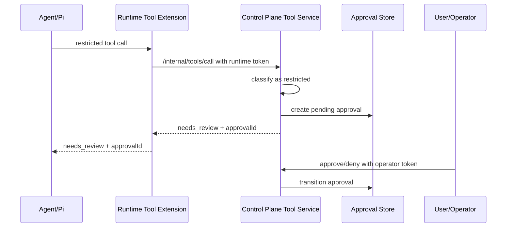
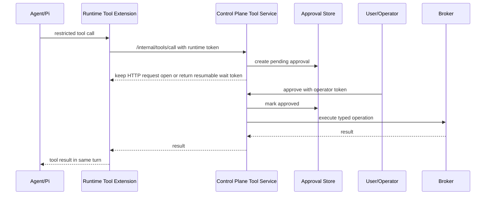

# Control Plane Approval Fallback Plan

## Current Decision

Build approval fallback in two stages:

1. **Mode A now:** restricted tool calls create a durable pending approval and return `needs_review` with an `approvalId`.
2. **Hold/wait later:** restricted tool calls can wait on that approval and resume the same tool call when the user approves.

This is an explicit implementation log. Mode A is not the final interaction model; it is the simplest durable checkpoint that proves classification, audit, approval state, and broker execution before we add in-memory or resumable waiters.

This plan assumes the three-zone split documented in
[Agent Runtime Boundaries](./agent-runtime-boundaries.md): the control plane is
the authority plane, the runtime house may request scoped tool execution, and
the agent workspace must not receive operator credentials or approval authority.

## Codex Reference Pattern

Codex does not expose an agent-callable "approve this" tool. The model asks for an authority-bearing action, execution policy decides the action needs approval, and the session emits an out-of-band approval request to the app/client side.

Relevant source references in `vendor/openai-codex`:

- `codex-rs/core/src/exec_policy.rs:331` maps policy decisions to `Forbidden`, `NeedsApproval`, or allow/skip.
- `codex-rs/core/src/exec_policy.rs:704` allows non-dangerous sandboxed commands under some approval policies without prompting.
- `codex-rs/core/src/session/mod.rs:1994` creates a pending approval oneshot, emits `ExecApprovalRequest`, then waits for the response.
- `codex-rs/app-server/src/bespoke_event_handling.rs:1964` deserializes the user/client approval response and maps it to `ReviewDecision`.
- `codex-rs/app-server/src/bespoke_event_handling.rs:2058` submits `Op::ExecApproval` back into the conversation.
- `codex-rs/core/src/session/handlers.rs:779` handles `Op::ExecApproval` inside the session.
- `codex-rs/app-server-protocol/schema/typescript/v2/AskForApproval.ts:5` defines approval policy modes.
- `codex-rs/app-server-protocol/schema/typescript/v2/ApprovalsReviewer.ts:12` defines reviewer modes: `user`, `auto_review`, `guardian_subagent`.
- `codex-rs/app-server-protocol/schema/typescript/v2/AppToolApproval.ts:5` defines app tool approval modes: `auto`, `prompt`, `approve`.

The Beep control plane should mirror the shape, not the exact protocol: tool execution can wait on an out-of-band approval response, and the agent should never be able to approve its own restricted action.

## Endpoint Safety

The user concern is correct: if approval endpoints are ordinary unauthenticated endpoints, the agent could call them. That would collapse the trust boundary.

Approval endpoints must therefore be on the **operator/user side** of the control plane, not on the runtime capability side.

Rules:

- Runtime receives only `BEEP_CONTROL_PLANE_RUNTIME_TOKEN`.
- Runtime token can call `/internal/tools/call` and model gateway endpoints.
- Runtime token must not authorize `/api/approvals/*`.
- Approval endpoints require a separate operator/user credential.
- The operator/user credential is never mounted into the runtime container and never passed to Pi.
- Every approval transition is audited.
- Boundary tests should assert that a restricted tool call returns
  `needs_review` and that the runtime token cannot approve, deny, cancel, or
  execute the pending approval through operator endpoints.

For local dev, the first credential can be a control-plane operator token stored under:

```text
.beep-dev/control-plane/operator-token
```

Local approval commands should read that token from the host and send it as:

```text
Authorization: Bearer <operator-token>
```

The runtime container must not be able to read this file.

## Mode A: Durable Needs Review

Restricted call flow:



Initial endpoints:

```text
GET  /api/approvals
GET  /api/approvals/:approvalId
POST /api/approvals/:approvalId/approve
POST /api/approvals/:approvalId/deny
POST /api/approvals/:approvalId/cancel
```

Mode A execution rule:

- Approval creates a durable record and may optionally execute the broker action after approval.
- The original agent turn has already received `needs_review`.
- Agent must retry or user must send a follow-up after approval.

Mode A is safer initially because it has no dangling tool waiter and survives control-plane restarts.

## Hold/Wait Target

Hold/wait is the preferred interaction once the approval state is proven.

Target flow:



Implementation choices to evaluate later:

- Long-held HTTP response from runtime tool extension.
- Polling wait endpoint with timeout.
- Server-sent events or WebSocket waiter.
- Durable resumable wait token for crash recovery.

Do not build hold/wait until the approval store, operator auth, audit, and restricted broker execution are working.

## First Restricted Action

Use a real restricted operation, not a fake tool.

Recommended first action:

```text
preview.container.createStaticSite
```

Reason:

- It is real authority.
- It is easy to understand.
- It is clearly restricted.
- It has bounded blast radius in local dev.
- It proves that default-allowed tools and review-required tools share one tool service without letting the runtime hold Docker authority.
- It creates something visible through the browser, so the approval path proves both container custody and preview custody.

The matching teardown path is operator-only: `POST /api/sites/<siteId>/stop`.

## Implementation Order

1. Add durable local control-plane command mode: `start`, `stop`, `restart`, `status`, `logs`, `foreground`.
2. Add operator-token auth for `/api/approvals/*`.
3. Add approval state to `StateStore`.
4. Add restricted action classification and approval creation in `ToolBroker`.
5. Add approval endpoints and audit transitions.
6. Add `preview.container.createStaticSite` as the first restricted broker operation.
7. Add docs and smoke tests.
8. Later, replace Mode A interaction with hold/wait once the state machine is proven.
