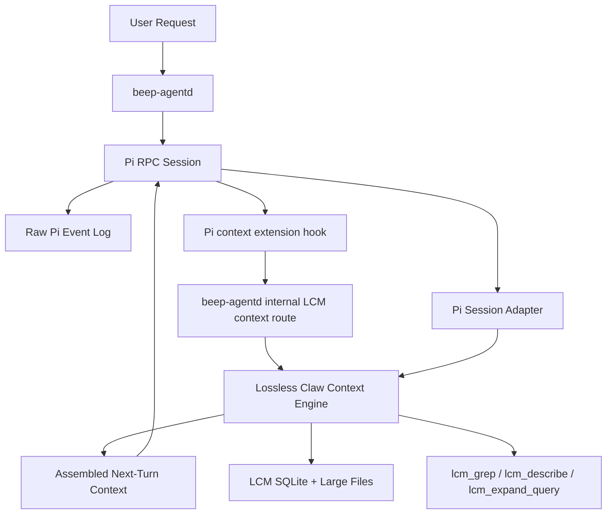

# LCM First-Party Integration Plan

## Purpose

Beep currently vendors Lossless Claw and proves that Pi RPC events can be written into an LCM SQLite database. That is not first-party-level integration yet. First-party Lossless Claw is a runtime context engine: it owns context assembly, canonical transcript ingestion, deduplication, compaction, recall tools, lifecycle hooks, and maintenance.

The target is to make Beep's Pi runtime use Lossless Claw at that level, not as a passive event sink.

## Current Beep State

Working:

- `beep-agentd` runs as a long-running Docker service.
- It autostarts the canonical `agent_beep` Pi RPC session.
- Pi runs against the `openai-codex` provider using ChatGPT/Codex auth from `/state/codex/auth.json`.
- Current runtime model selection is `gpt-5.5` with `thinking=low`.
- The daemon has a durable request queue under `/state/api/agents/beep`.
- The clean-slate proof request completed through the long-running session and wrote `clean-slate-lcm-proof.txt` in `/workspace/api-sessions/agent_beep`.
- LCM SQLite exists at `/lcm/beep-lcm.sqlite`.
- New completed requests are imported from Pi's durable session JSONL through Lossless Claw's `LcmContextEngine.ingestBatch`.
- The LCM checkpoint is based on Pi session message count, so replaying `/agent/lcm` does not duplicate already-ingested transcript messages.
- Forced proof compaction and context assembly work through `LcmContextEngine.compact` and `LcmContextEngine.assemble`.
- The dev runtime has been reset to a clean LCM baseline: 1 conversation, 4 messages, 5 message parts, and 0 legacy raw-event rows.
- `beep-agentd` now uses an in-process `LcmService`, so normal runtime recording and control endpoints share one Lossless Claw engine/DB connection instead of shelling out to a proof script.
- Private control-plane endpoints now expose status, compaction, assemble preview, maintain, rotate, backup, and doctor operations.
- Pi context injection now uses Pi's first-party extension `context` hook. `beep-agentd` loads `/runtime/pi-extensions/lcm-context-extension.mjs` into the long-running Pi RPC process, and that extension calls the daemon's internal `POST /internal/lcm/context` route before each provider call.
- When the extension is loaded, `beep-agentd` disables Pi native auto-compaction through RPC so Lossless Claw owns pre-model context assembly.
- The live proof request `agent_req_mpe4o9t8_16ee86e4` completed through the long-running agent, created `lcm-context-injection-proof.txt`, made 2 successful LCM assemble calls during the turn loop, and appended 4 new canonical transcript messages to LCM.

Not first-party-level yet:

- Production will still need a rotate/archive policy for any future polluted or obsolete runtime state, but the current dev baseline is clean.
- Tiny raw-message-only histories currently return Lossless Claw's safe live-context fallback instead of a summary-backed `thread_bootstrap` projection. That is correct first-party behavior until summaries or complete context-item coverage exist.
- Beep is not yet calling the full first-party lifecycle around every turn: post-turn compaction policy, `maintain`, session reset hooks, and first-party recall tools.
- LCM commands and recall tools are not yet surfaced through stable control-plane endpoints.

## How First-Party Lossless Claw Handles It

The first-party plugin wires into the host runtime through `vendor/lossless-claw/src/plugin/index.ts`:

- `before_prompt_build`: prepends the Lossless recall policy.
- `registerContextEngine("lossless-claw", ...)`: exposes a runtime context engine.
- `registerTool`: adds `lcm_grep`, `lcm_describe`, `lcm_expand`, and `lcm_expand_query`.
- `registerCommand`: adds `/lcm`, `/lcm status`, `/lcm rotate`, `/lcm doctor`, and related command handling.
- `before_reset`: applies `/new` and `/reset` semantics.
- `session_end`: handles rollovers, deletion, and session lifecycle cleanup.

The first-party engine is `LcmContextEngine` in `vendor/lossless-claw/src/engine.ts`.

It handles runtime state this way:

1. Bootstrap or reconcile the canonical session transcript.
2. Ingest only persistable agent messages, not raw transport events.
3. Store messages and structured parts in SQLite.
4. Append context items that can later be raw messages or summary references.
5. Deduplicate replayed batches and crash-recovered tails.
6. Externalize large files, large tool outputs, and large raw payloads.
7. After each turn, evaluate whether compaction is needed.
8. Record deferred compaction debt or compact inline depending on config.
9. Assemble future model context from summaries plus a protected fresh tail.
10. Expose recall tools so the agent can search, describe, and expand compacted history.
11. Maintain transcript storage with optional GC and `/lcm rotate`.

The key distinction: Lossless Claw preserves every meaningful transcript message. It does not require every streaming event or duplicate snapshot to become a memory message.

## Correct Beep Architecture

The adapter is not the memory system. It is the boundary glue that maps Pi's session JSONL shape into Lossless Claw's canonical message input. Raw event logs remain useful for diagnostics, replay, UI progress, and debugging. They should not be the memory substrate.

## Required Beep Modules

### 1. Pi Session Adapter

Input:

- Pi session JSONL from `/state/api/sessions/<id>/pi-sessions/*.jsonl`.
- Pi RPC events from `/state/api/sessions/<id>/events.jsonl` only for diagnostics and fallback metadata.

Output:

- Calls into `LcmContextEngine.ingestBatch` with canonical transcript messages compatible with Lossless Claw.

Rules:

- Keep user prompt once.
- Keep assistant final message once per assistant response.
- Keep tool calls and tool results as structured parts.
- Keep final answer once.
- Preserve response IDs, tool call IDs, model metadata, usage, and timestamps as metadata.
- Drop streaming-only events from LCM memory: `message_update`, `tool_execution_update`, `response`, empty `message_start`, routine `agent_start`, routine `agent_end`.
- Keep raw JSONL as diagnostics, not as LCM conversation rows.

Acceptance:

- A request that previously appended roughly 100 raw-event rows appends only the new canonical Pi session messages.
- The persisted message count tracks Pi's durable session message count order of magnitude.
- Re-running LCM ingest over the same completed request is idempotent.
- Current proof: the clean-slate live request `agent_req_mpdjyo6f_8bba9e23` appended 4 canonical messages and 4 context items from a zero-row LCM DB, then a second `/agent/lcm` pass appended 0 messages and 0 context items.

### 2. Beep LCM Engine Adapter

Replace passive store writes with a wrapper around first-party `LcmContextEngine` behavior.

Responsibilities:

- Initialize the Lossless Claw DB and migrations.
- Create an LCM conversation per stable Beep runtime session.
- Call `assemble` before Pi model turns once Pi integration supports context injection.
- Call `afterTurn` after each completed canonical turn.
- Call `maintain` for deferred compaction and transcript maintenance.
- Expose `compact`, `rotate`, status, and diagnostics through Beep runtime/control APIs.

Acceptance:

- LCM summaries are created when thresholds are forced low in test config.
- Future context can be assembled from summaries plus fresh tail.
- LCM no longer has `summaries=0` after a forced compaction test.
- Current proof: forced temp-DB compaction over 37 Pi session messages created 3 summaries and assembled 4 context messages with `contextProjection.mode=thread_bootstrap`.

### 3. Pi Context Injection

Pi currently owns its session context. Beep needs a controlled way to feed Lossless Claw's assembled context into Pi before model calls.

Implemented route:

- Keep `--mode rpc` for daemon control.
- Load a Beep Pi extension via `--extension /runtime/pi-extensions/lcm-context-extension.mjs`.
- Use Pi's existing `context` event, which runs before `convertToLlm`.
- Have the extension call `POST /internal/lcm/context` with the live Pi `AgentMessage[]`.
- Have `beep-agentd` call `LcmContextEngine.assemble(...)` through the in-process `LcmService`.
- Return the assembled message array to Pi before the provider request.
- Disable Pi native auto-compaction while this route is active.

Acceptance:

- A large prior conversation can be compacted by LCM and still influence the next Pi turn.
- Pi native compaction is disabled when Lossless Claw owns compaction.
- No duplicate or conflicting compaction summaries are written by Pi and LCM for the same turn.
- Current proof: the request `agent_req_mpe4o9t8_16ee86e4` made two `assemble` calls through the extension path. LCM safely fell back to live context because the current dev history has no summaries and the DB context items trail the live turn by the unpersisted prompt/tool messages.

### 4. LCM Recall Tool Surface

Register LCM tools into Pi as normal tools:

- `lcm_grep`
- `lcm_describe`
- `lcm_expand_query`

`lcm_expand` should remain restricted to delegated/sub-agent recall contexts, matching first-party Lossless Claw's recursion guard.

Acceptance:

- The agent can search old memories without direct SQL.
- The agent can expand a summary into source-backed details.
- Tool outputs cite summary IDs or message references for follow-up.

### 5. Large Payload Handling

Mirror Lossless Claw's first-party behavior:

- Externalize large tool results and raw payloads into LCM large-file storage.
- Store compact references in message rows.
- Use `lcm_describe` to inspect large payloads.
- Enable stub substitution for evictable large tool results after migration and tests.

Acceptance:

- Large tool output does not blow up active context.
- Raw payload remains recoverable.
- Fresh tail is never stubbed.

### 6. Compaction And Maintenance Controls

Expose Beep-native controls equivalent to first-party `/lcm` commands:

- `GET /agent/lcm/status`
- `POST /agent/lcm/compact`
- `POST /agent/lcm/assemble-preview`
- `POST /agent/lcm/rotate`
- `POST /agent/lcm/maintain`
- `GET /agent/lcm/doctor`
- `POST /agent/lcm/backup`

Future UI can map these to buttons rather than command-line usage.

Acceptance:

- Forced compaction creates summaries.
- Rotate preserves active conversation identity and summaries while shrinking transcript storage.
- Doctor reports corrupted/truncated summaries.
- Status shows DB size, row counts, summary counts, deferred compaction debt, fresh tail config, and active conversation.

### 7. Session Policy

Implement the same session controls Lossless Claw expects:

- `ignoreSessionPatterns` for proofs, throwaway tests, and low-value maintenance sessions.
- `statelessSessionPatterns` for delegated runs that may read context but must not mutate memory.
- Heartbeat pruning for routine idle acknowledgements.
- Session reset and rotation semantics.

Acceptance:

- Smoke tests and idle heartbeat-only runs do not pollute durable memory.
- Delegated recall does not recursively write noisy LCM state.
- Real user work remains lossless.

### 8. Storage Budgets

LCM's first-party goal is not "small DB"; it is "bounded active context with recoverable raw history." Beep still needs operational budgets.

Policies:

- Raw Pi event logs: rotate and compress by size/time.
- LCM DB: keep canonical messages, summaries, and large-file references.
- Large files: cap per-user storage and add explicit deletion/export policy.
- Backups: bounded retention.
- SQLite: expose `VACUUM` or equivalent maintenance through explicit admin/control action.

Acceptance:

- Storage growth is predictable per user.
- Active context remains bounded even across long-running sessions.
- Raw diagnostics can be trimmed without losing LCM memory.

## Pi And Runtime Assessment

Pi is viable for the current harness choice:

- `--mode rpc` supports long-running subprocess control.
- It supports prompt acceptance, steering, follow-ups, aborts, session switching, model changes, compaction commands, and session stats.
- Its docs explicitly say durable harness recovery should be session-log based and that provider streams are not resumable.
- That matches Beep's intended daemon model.

Current runtime status:

- Docker service can build and start.
- `beep-agentd` is healthy from inside the container and outside the sandbox.
- Host sandboxed curl may fail because of the local execution sandbox, but escalated host curl succeeds.
- The Pi RPC session is running.
- `get_state` succeeds without a model call.
- Current state after the live proof request: `model=gpt-5.5`, `thinkingLevel=low`, `autoCompactionEnabled=true`, `messageCount=37`, `pendingMessageCount=0`.

Current runtime gap:

- It works as a long-running Pi/Codex-auth daemon.
- It now imports Pi session messages through Lossless Claw's context engine.
- It does not yet inject assembled LCM context back into Pi before model calls.
- It does not yet expose first-party recall tools or full `/lcm` lifecycle controls.

## Implementation Slices

### Slice A: Stop LCM Event Flood

- Keep raw Pi events in JSONL.
- Add a Pi session adapter.
- Replace `lcm-record-events.mjs` memory writes with canonical session-message ingestion.
- Add regression tests using saved Pi session logs.

Status: implemented for live daemon ingestion. The old event importer remains only as legacy code and should be removed or kept behind an explicit diagnostics-only path.

### Slice B: Use Lossless Claw Stores Correctly

- Preserve structured message parts.
- Store tool calls/results with stable tool IDs.
- Store model usage and response IDs as metadata, not separate memory messages.
- Make ingestion idempotent.

Status: implemented for the current Pi session path. Clean-slate live proof imported 4 messages from a zero-row DB, then imported 0 on the replay pass.

### Slice C: First Forced Compaction

- Add a low-threshold test config.
- Force LCM compaction on a synthetic long transcript.
- Prove `summaries > 0`.
- Prove assembled context includes summaries plus fresh tail.

Status: proven against a temp DB using the real Pi session transcript. Forced compaction over 37 messages created 3 summaries and assembled a 4-message next-turn context projection.

### Slice D: Runtime LCM API

- Add status, compact, rotate, maintain, and doctor endpoints.
- Keep these private to the control plane.
- Return structured JSON suitable for future UI buttons.

Status: implemented through `LcmService` for `/agent/lcm/status`, `/agent/lcm/compact`, `/agent/lcm/assemble-preview`, `/agent/lcm/maintain`, `/agent/lcm/rotate`, `/agent/lcm/backup`, and `/agent/lcm/doctor`.

### Slice E: Pi Context Hook

- Decide whether to embed `AgentSession` directly or patch Pi provider/extension hooks.
- Feed LCM-assembled context into model calls.
- Disable or subordinate Pi-native compaction when LCM owns compaction.

### Slice F: Recall Tools

- Register `lcm_grep`, `lcm_describe`, and `lcm_expand_query` as Pi tools.
- Add recursion and stateless-session guards.
- Prove the agent can recover an old detail through LCM recall.

### Slice G: Storage And Lifecycle

- Add event-log rotation/compression.
- Add session ignore/stateless policy.
- Add heartbeat pruning.
- Add rotate/backup/doctor controls.
- Add DB and large-file budget reporting.

## Next Concrete Step

Build the first part of Slice E:

1. Decide the Pi hook point for pre-call context injection: embedded `AgentSession` if Pi exposes the needed hook, otherwise a provider/adapter layer before Codex completion requests.
2. Feed `LcmService.assemblePreview` output into Pi's next model request as working context, not merely as an inspection endpoint.
3. Disable or subordinate Pi-native compaction when LCM owns compaction for a session.
4. Add a test that proves an old detail is recovered through assembled LCM context or recall tooling, not by raw transcript still being in Pi's active context.

That moves us from correct memory recording into actual first-party runtime behavior.
