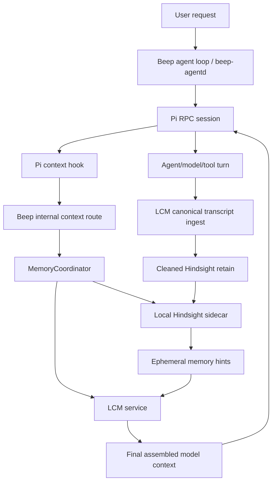

# Hindsight + LCM Sidecar Evaluation Design

Date: 2026-05-29
Branch: `codex/hindsight-lcm-eval`
Status: Approved design for implementation planning

## Purpose

Evaluate whether Beep can use Hindsight as a local learned-memory layer while
keeping Lossless Claw LCM as Beep's final context manager. The result should be
a proof bench, not a partial bolt-on: Hindsight should be used in the style its
docs describe, and LCM should keep owning transcript continuity, compaction, and
final model context assembly.

## Sources

- Hindsight local Docker/self-hosted service and API: https://github.com/vectorize-io/hindsight
- Hindsight Codex hook integration: https://hindsight.vectorize.io/sdks/integrations/codex
- Hindsight retain API, `document_id`, metadata, and tags: https://hindsight.vectorize.io/0.4/developer/api/retain
- Hindsight reflect API and recall/reflect distinction: https://docs.hindsight.vectorize.io/api-reference/reflect/
- Agent Memory Benchmark: https://github.com/vectorize-io/agent-memory-benchmark

## Constraints And Decisions

- Hindsight must be local-only. No Hindsight Cloud dependency is allowed.
- The BeepBot deployment uses one local Hindsight sidecar service.
- Use the official Hindsight sidecar image when possible. Do not vendor or fork
  Hindsight unless stock behavior cannot support the required local model
  routing.
- Hindsight's model-dependent work must route through Beep's existing
  Codex/chat-completion-compatible model path, using a configurable memory model.
- Accuracy and end-user experience are prioritized over minimum latency or
  minimum resource overhead for this evaluation.
- LCM remains the transcript and context-window authority.
- Hindsight becomes the durable learned-memory layer for facts, preferences,
  decisions, corrections, and agent experiences.
- Beep owns all bank selection and memory scoping. The agent/model must not
  choose `bank_id`.

## Current Beep Baseline

Beep already runs a long-lived Pi RPC session through `beep-agentd`. Pi loads
`runtime/pi-extensions/lcm-context-extension.mjs`, whose `context` hook calls
Beep's internal `POST /internal/lcm/context` route before provider conversion.
That route currently calls `LcmService.assembleMessages(...)`, and completed Pi
session messages are ingested into LCM as canonical transcript after the turn.

This existing internal context route is the real pre-model arbitration point.
The Hindsight integration should attach there, not at a generic submit route,
so it covers prompts, follow-ups, steering, and multi-call turns consistently.

## Architecture



The sidecar is the deployment shape. Hooks are the lifecycle mechanism.
Hindsight recall is invoked at the existing pre-model context hook boundary;
Hindsight retain is invoked after successful LCM canonical ingest.

## Components

### Hindsight Sidecar

Runs the official local Hindsight service. It owns memory banks, retain, recall,
reflect, observations, and storage. Beep treats it as stock API infrastructure.

The first implementation task must prove whether the stock sidecar can be
configured to send all model-dependent work to Beep's local
OpenAI/chat-completions-compatible endpoint. This includes extraction,
reflection, scoring/reranking if applicable, and embeddings if applicable. If
stock configuration is insufficient, add a narrow Beep-owned local
OpenAI-compatible proxy before considering a Hindsight fork.

### Beep Hindsight Adapter

Thin API client responsible for:

- health checks and warmup
- local endpoint configuration
- bank IDs, tags, and document IDs
- request budgets and timeouts
- retryable and terminal error normalization
- telemetry suitable for proof tests

The adapter should not contain memory policy beyond transport and response
normalization.

### MemoryCoordinator

Deterministic lifecycle coordinator owned by Beep. It is not an AI decision
maker. When Hindsight is enabled, it tries recall at every internal context
assembly boundary and lets Hindsight's retrieval decide whether anything
relevant exists.

Responsibilities:

- derive a recall query from live Pi messages and the latest user prompt
- call Hindsight recall read-only before LCM assembly
- format results as non-persistable `externalMemoryHints`
- pass those hints into LCM assembly
- after the turn, strip injected memory and retain cleaned source spans
- queue/retry Hindsight retain failures without failing the user turn

Inline pre-model `reflect` is allowed only if it is read-only. If reflect
mutates observations, promotes memories, or otherwise changes the memory bank,
it must run only after the turn as maintenance.

### LCM

LCM owns final prompt/context shape. It consumes live Pi messages plus
`externalMemoryHints`, chooses ordering and budget, and returns the final model
messages. It persists only canonical transcript, summaries, fresh tail,
compaction state, and LCM metadata. It must not persist Hindsight injected
memory as user or assistant transcript.

### Pi / Beep Agent Loop

Pi continues to own the agent turn, provider calls, tool loop, streaming, model
selection, and RPC session behavior. Pi should not call Hindsight directly.
Beep owns Hindsight/LCM ordering and arbitration.

### Updater

The updater must handle both:

- Hindsight: pinned official image tag or digest, pulled and smoke-tested as a
  local sidecar.
- LCM: existing vendored reference update path.

The update flow should run compatibility proof tests before declaring success.

## Lifecycle Ordering

1. Pi's `context` hook calls Beep's internal context route.
2. Beep derives the recall query from live Pi messages.
3. Beep calls Hindsight recall read-only.
4. Beep converts recall results to tagged ephemeral `externalMemoryHints`.
5. Beep calls LCM assembly with live messages plus `externalMemoryHints`.
6. LCM performs final context assembly and budget decisions.
7. The agent/model/tool turn runs.
8. Beep ingests only canonical Pi transcript into LCM.
9. Beep strips injected Hindsight memory and retains cleaned source spans to
   Hindsight with stable `document_id`, bank, tags, and metadata.
10. Hindsight retain failures queue/retry and do not fail the user turn.

This preserves the division of labor:

- Hindsight learns and recalls durable semantic memory.
- LCM controls final active context and continuity.
- Beep owns lifecycle hooks, ordering, security, and telemetry.

## Ephemeral Memory Hint Contract

Hindsight recall output must be represented as a first-class non-persistable
context contribution, not as ordinary transcript messages.

Required shape:

```json
{
  "schemaVersion": 1,
  "source": "hindsight",
  "persist": false,
  "stripOnRetain": true,
  "bankId": "beep:<deployment>:<user-or-project>",
  "query": "latest prompt plus selected recent context",
  "mode": "recall",
  "budget": "high",
  "generatedAt": "2026-05-29T00:00:00.000Z",
  "tokenBudget": 4096,
  "memories": [
    {
      "id": "memory-id",
      "text": "Memory text returned by Hindsight",
      "kind": "world|experience|opinion|observation",
      "score": 0.91,
      "documentId": "beep-session:<session-id>:<turn-range>",
      "tags": ["deployment:<id>", "user:<id>", "project:<id>"],
      "sourceRef": {
        "sessionId": "agent_beep",
        "requestId": "agent_req_x",
        "messageRange": "12-16"
      },
      "createdAt": "2026-05-29T00:00:00.000Z",
      "updatedAt": "2026-05-29T00:00:00.000Z"
    }
  ]
}
```

LCM may render this into protected model-visible context, but the hint object
must remain identifiable in telemetry and excluded from canonical persistence.
Current user corrections and LCM fresh-tail content outrank stale Hindsight
memory when they conflict.

## Retain Policy

Retain cleaned source spans after successful LCM ingest. The retained text
should be the real user/assistant/tool transcript content, not the LCM assembled
prompt and not previously injected Hindsight memory.

Use stable `document_id` values so replay and restart update the same document
instead of creating duplicates. Prefer span-level IDs rather than one growing
whole-session document if proof tests show better idempotency and lower
feedback-loop risk.

Suggested metadata:

- deployment ID
- bank ID
- runtime session ID
- Beep request ID
- Pi session file path/hash
- LCM conversation/session key
- turn/message range
- model and thinking level
- source integration: `beep-pi`

Suggested tags:

- `deployment:<id>`
- `user:<id>`
- `project:<id>`
- `session:<id>`
- `source:beep-pi`

## Isolation And Conflict Policy

The single sidecar may serve multiple banks, but Beep owns all scoping:

- Bank IDs are derived from deployment/user/project policy.
- The model cannot request arbitrary banks.
- Recall must include tags appropriate to the current user/project/session.
- Tests must prove canaries do not cross banks or tags.
- If Hindsight memory conflicts with current live context, current live context
  wins.
- If Hindsight memory conflicts with a later explicit correction, the correction
  wins and should be retained.

## Proof Bench

The evaluation branch must include two proof lanes.

### AMB Memory-Quality Lane

Add a Beep/Hindsight memory provider for AMB or an equivalent wrapper that can
run the AMB ingest, retrieve, generate, and judge flow against the local
sidecar. Run ablations:

- baseline memory provider supplied by AMB
- Hindsight sidecar alone
- Beep LCM-derived recall if a comparable provider exists
- Beep LCM + Hindsight integration where applicable

Datasets should start small for developer iteration, then include LoComo,
LongMemEval, LifeBench, and PersonaMem where local availability and run time
allow.

### End-To-End Beep Lane

Run deterministic Beep/Pi sessions with a coding-agent scenario:

1. Introduce project-specific rules, corrections, and decisions.
2. Retain them through Hindsight.
3. Restart the runtime or force LCM compaction so raw active context is not the
   source of truth.
4. Submit underspecified follow-up work.
5. Compare Beep + LCM against Beep + LCM + Hindsight.

The combined system passes only if it uses the retained learned memory while LCM
continues to manage active context and transcript continuity.

## Mandatory Acceptance Tests

- Local-only sidecar: Hindsight health, retain, recall, and read-only reflect
  work locally without Hindsight Cloud.
- Model routing: every Hindsight model-dependent call reaches the configured
  Beep/Codex-compatible endpoint and memory model.
- Hook placement: Hindsight recall occurs from the internal context assembly
  route so prompts, follow-ups, steering, and multi-call turns are covered.
- No persistence: injected Hindsight canaries appear in model-visible context
  but not in LCM canonical messages and not in retained Hindsight source text.
- Idempotent retain: replaying the same completed request does not duplicate LCM
  rows or Hindsight documents.
- Feedback-loop resistance: repeated recall, answer, and retain cycles do not
  multiply injected-only facts or increase their confidence.
- Restart and compaction: after runtime restart and forced LCM compaction,
  Beep + LCM + Hindsight recovers learned details that Beep + LCM alone does
  not.
- Stale conflict: a later explicit user correction outranks older Hindsight
  memory and updates future recall behavior.
- Bank isolation: two banks with canaries never cross-recall, even if the prompt
  asks for another bank's memory.
- Failure mode: Hindsight timeout or outage returns LCM-only context, records
  telemetry, and queues retain retry without failing the user turn.
- Updater: updating Hindsight image and LCM reference runs compatibility smoke
  tests before success.

## Non-Goals For This Evaluation

- Do not optimize sidecar memory or CPU overhead before proving quality.
- Do not build a UI.
- Do not replace LCM with Hindsight.
- Do not let Pi or the model choose banks directly.
- Do not fork Hindsight unless stock sidecar plus a narrow local model proxy
  cannot meet the local-only routing requirement.

## Implementation Plan Entry Point

The implementation plan should start with stock Hindsight sidecar compatibility:

1. Start the official Hindsight sidecar locally.
2. Prove local API health and local storage.
3. Prove all Hindsight model-dependent calls can use Beep's configured
   Codex/chat-completion-compatible endpoint, or design the narrow local proxy.
4. Only after that proof, implement the Beep adapter and internal-context-route
   coordinator.
