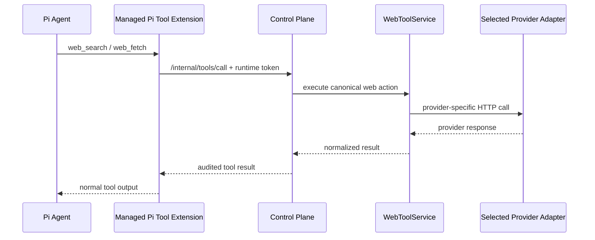

# Beep Web Tool Surface

## Purpose

Web access is an external freshness capability, not memory. The agent should
interact with the outside web through normal tool calls, while API keys,
provider selection, cost policy, audit, and network authority stay in the
control plane.

The design goal is a vendored adapter surface: each provider is implemented by
Beep-owned HTTP adapter code behind one canonical tool contract. Switching
providers should require changing configuration, not changing the agent prompt
or runtime code.

## Current State

Implemented architecture:

- `web_search` and `web_fetch` are registered as normal Pi tools by the managed
  control-plane tool extension.
- Both tools call `POST /internal/tools/call` with the runtime capability token.
- The control plane executes `web.search` and `web.fetch` through
  `WebToolService`.
- Provider adapters are vendored under `control-plane/src/web-providers/`.
- The default providers are selected with `BEEP_WEB_SEARCH_PROVIDER` and
  `BEEP_WEB_FETCH_PROVIDER`; `BEEP_WEB_TOOL_PROVIDER` may set both for simple
  deployments.
- Individual calls may pass `provider` for evaluation runs.
- API keys stay in control-plane environment variables, never in the runtime
  workspace.
- `node scripts/benchmark-web-tools.mjs` runs cross-provider search fixtures
  through the same `WebToolService` production uses.

Not implemented yet:

- Provider keys in local/dev deployment.
- A UI/API surface for provider status and evaluation reports.
- Saved benchmark reports and ranking summaries.
- Durable writeback policy for search results beyond normal LCM transcript
  capture.

## Provider Research

The practical provider categories are:

| Provider | Best Fit | Tradeoff |
|---|---|---|
| OpenAI `web_search` | Model-native grounded answering in OpenAI Responses API. | Strong integration, but less provider-neutral and not a raw ranked-result API. |
| Tavily | General AI-agent search with search, extract, crawl, and map APIs. | Good default candidate; quality depends on query and depth settings. |
| Exa | Neural/semantic search and contents retrieval. | Strong for concept discovery and high-quality content retrieval; not a traditional SERP. |
| Brave | Independent web index and fast ranked results. | Good broad index and snippets; extraction needs another provider. |
| Firecrawl | Search plus scrape/extract, especially dynamic or messy pages. | Strong extraction; more expensive when used as a full scraping layer. |
| Linkup | AI-focused search/fetch/research with latency/quality modes. | Promising production option; use provider benchmarks before making default. |
| Perplexity Search API | Raw ranked results with extraction controls. | Search API is suitable for tools; Sonar is better treated as an answer engine. |
| SerpAPI | Google SERP compatibility and rich vertical results. | Useful baseline and vertical fallback; not source extraction. |

Research basis:

- [OpenAI Web Search](https://developers.openai.com/api/docs/guides/tools-web-search)
  exposes web search as a Responses API hosted tool.
- [Tavily Search](https://tavilyai.mintlify.app/documentation/api-reference/endpoint/search)
  and [Tavily Extract](https://tavilyai.mintlify.app/documentation/api-reference/endpoint/extract)
  support snippets, optional answers, raw content, domain filters, freshness
  filters, and page extraction.
- [Exa Search](https://exa.ai/docs/reference/search) and
  [Exa Contents](https://exa.ai/docs/reference/contents-api-guide) can return
  semantic results plus extracted page text.
- [Brave Search API](https://brave.com/search/api/) provides an independent
  index, web endpoint, snippets, and specialized endpoints.
- [Firecrawl Search](https://docs.firecrawl.dev/api-reference/endpoint/search)
  combines search with optional scrape output; [Firecrawl Scrape](https://docs.firecrawl.dev/api-reference/endpoint/scrape)
  returns markdown/html/structured formats.
- [Linkup Search](https://docs.linkup.so/pages/documentation/endpoints/search/overview)
  and [Linkup Fetch](https://docs.linkup.so/pages/documentation/endpoints/fetch/overview)
  provide AI-focused search and extraction with `fast`, `standard`, and `deep`
  modes.
- [Perplexity Search API](https://docs.perplexity.ai/api-reference/search-post)
  returns raw ranked results; Sonar returns prose answers with citations.
- [SerpAPI Google Search](https://serpapi.com/search-api) returns structured
  Google SERP data and is useful for comparison.

## Runtime Shape



The agent sees stable tools. The control plane owns provider credentials and
selection. The runtime owns no provider keys and does not make direct external
web calls.

## Canonical Tools

### `web_search`

Use for current or external information. Canonical input:

```ts
type WebSearchInput = {
  query: string;
  provider?: "tavily" | "exa" | "brave" | "firecrawl" | "linkup" | "perplexity" | "serpapi";
  maxResults?: number;
  freshness?: "day" | "week" | "month" | "year";
  includeDomains?: string[];
  excludeDomains?: string[];
  country?: string;
  language?: string;
  includeContent?: boolean;
  includeAnswer?: boolean;
};
```

Canonical output:

```ts
type WebSearchOutput = {
  kind: "web_search";
  selectedProvider: string;
  provider: string;
  query: string;
  answer?: string | null;
  results: Array<{
    title: string;
    url: string;
    snippet: string;
    content: string;
    publishedAt: string | null;
    score: number | null;
    sourceType: string;
    providerResultId: string | null;
    metadata: Record<string, unknown>;
  }>;
  usage?: Record<string, unknown> | null;
  requestId?: string | null;
  warnings?: string[];
};
```

### `web_fetch`

Use when a URL or search result needs exact source text.

```ts
type WebFetchInput = {
  url: string;
  provider?: "tavily" | "exa" | "firecrawl" | "linkup";
  query?: string;
  contentFormat?: "markdown" | "text" | "html";
};
```

Providers that do not support extraction should fail clearly rather than
silently falling back to a different provider.

## Provider Configuration

Default providers:

```text
BEEP_WEB_SEARCH_PROVIDER=tavily
BEEP_WEB_FETCH_PROVIDER=tavily
```

Single-provider deployments can set both with:

```text
BEEP_WEB_TOOL_PROVIDER=tavily
```

Supported keys:

```text
BEEP_TAVILY_API_KEY
BEEP_EXA_API_KEY
BEEP_BRAVE_SEARCH_API_KEY
BEEP_FIRECRAWL_API_KEY
BEEP_LINKUP_API_KEY
BEEP_PERPLEXITY_API_KEY
BEEP_SERPAPI_API_KEY
```

Provider override is allowed for evaluation calls, but normal agent work should
omit it and use the configured search/fetch defaults.

## Provider Adapter Rules

Adapters must:

- Use direct HTTP calls, not SDK-specific runtime dependencies.
- Return the canonical shape even when the provider response differs.
- Preserve source URLs, titles, snippets, extracted content, provider request ID,
  and usage/cost metadata when available.
- Fail closed when credentials are missing or the provider does not support the
  requested capability.
- Avoid hidden fallback between providers during normal tool calls.
- Keep provider-specific fields under `metadata`.

Adapters must not:

- Store provider keys in the runtime or workspace.
- Let the agent mutate provider configuration.
- Write search results directly into semantic memory.
- Hide provider failures by silently choosing a different provider.

## Evaluation Plan

Benchmarking calls the same `WebToolService` surface that production uses:

```bash
node scripts/benchmark-web-tools.mjs \
  --providers tavily,exa,brave,firecrawl,linkup,perplexity,serpapi \
  --out control-plane/evals/runs/web-tools.jsonl
```

Evaluation fixture fields:

```ts
type WebEvalCase = {
  id: string;
  query: string;
  intent: "current_fact" | "official_docs" | "news" | "local" | "technical" | "broad_research";
  includeDomains?: string[];
  freshness?: "day" | "week" | "month" | "year";
  expectedDomains?: string[];
  mustFindUrls?: string[];
  notes?: string;
};
```

Metrics:

- Result relevance.
- Official-source hit rate.
- Freshness.
- Duplicate/spam rate.
- Extracted-content usefulness.
- Latency.
- Provider errors and rate limits.
- Cost per useful result.

The first fixture set lives at
`control-plane/evals/web-tool-cases.jsonl`.

Initial comparison set:

1. Tavily basic and advanced.
2. Exa auto and neural.
3. Brave web search.
4. Firecrawl search with and without scrape output.
5. Linkup fast and standard.
6. Perplexity Search API.
7. SerpAPI Google search.

OpenAI hosted web search should be evaluated separately as a model-native
answering mode, not as the default raw result provider.

## Next Step

Wire provider keys into the local control-plane environment for two providers:
Tavily as the initial general default, and Brave or Exa as the first comparison
baseline. Then run `node scripts/benchmark-web-tools.mjs --providers ... --out
control-plane/evals/runs/web-tools.jsonl` and use the results to decide the
default search and fetch providers independently.
